# 📊 E-Commerce Marketing & Sales Analysis (2019)
## 🧩 Business Problem & Case Study

In a rapidly growing e-commerce market, the company seeks to **maximize customer acquisition**, **enhance retention**, and **optimize revenue**, while ensuring **efficient marketing spend**. Despite year-round sales activity, fluctuations in customer growth, inconsistent marketing ROI, and uneven revenue contributions from different customer segments present critical business challenges.

This project leverages a full year (**2019**) of transaction, marketing, and customer data to address over 20 specific business questions spanning:

- 📈 Monthly acquisition and retention trends  
- 💸 Coupon effectiveness and purchase behavior  
- 🧠 Customer segmentation and lifetime value  
- 📦 Product/category performance and seasonality  
- 📊 Marketing ROI and pricing/delivery optimization  

Through **exploratory data analysis (EDA)**, **statistical testing**, and **segmentation techniques**, we aim to deliver **insightful, actionable strategies** to improve customer engagement and support sustainable revenue growth.

## 📦 Dataset Overview
All data spans **January 1, 2019 to December 31, 2019**.

| **Dataset**             | **Description**                                | **Key Fields**                                                  |
|-------------------------|------------------------------------------------|------------------------------------------------------------------|
| `Online_Sales.csv`      | Transaction-level sales data                   | `CustomerID`, `Transaction_Date`, `Product_Category`, `Quantity`, `Avg_Price`, `Coupon_Status`, `Delivery_Charges` |
| `Customers_Data.csv`    | Customer demographics and tenure               | `Gender`, `Location`, `Tenure_Months`                            |
| `Discount_Coupon.csv`   | Coupon availability by category and month      | `Month`, `Product_Category`, `Discount_pct`                      |
| `Marketing_Spend.csv`   | Daily marketing spend (online & offline)       | `Date`, `Offline_Spend`, `Online_Spend`                          |
| `Tax_Amount.csv`        | GST rate by product category                   | `Product_Category`, `GST`                                       |

All data spans January 1, 2019 to December 31, 2019.

## 📅 Monthly Acquisition Trends

- **Highest acquisition month**: January, with **215 new customers**
- **Lowest acquisition month**: November, with only **68 new customers**
- **Coefficient of Variation (CV)** in acquisition: **0.36**, indicating **high month-to-month volatility** in customer acquisition patterns

Such variation causes challenges in resource planning, budget forecasting, and consistent sales pipeline development.

---
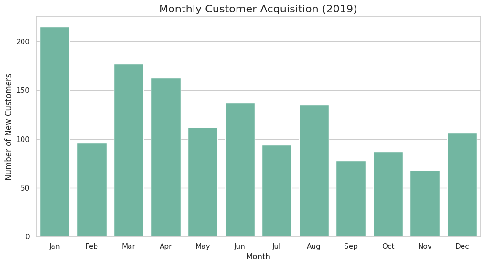

---

### ✅ Recommendations

Our analysis reveals significant variability in monthly customer acquisition. January outperforms with 215 new customers (40% above average), while November significantly underperforms with just 68 (43% below average). The high coefficient of variation (0.36) highlights a need for strategic intervention to ensure year-round acquisition consistency.

We recommend:

- 📬 **Launching a Q4 “Reactivation” campaign**: Incentivize dormant customers or lapsed browsers in slower months like November with personalized reactivation emails or flash discounts.
- 💰 **Reallocating of marketing budget** from high-performing months to February, September, and November, where acquisition drops significantly.
- 🎯 **Introducing limited-time offers** like first-purchase bundles or trial products targeted at new users during historically low-acquisition periods.
- 📈 **Running performance forecasting models** to pre-emptively boost acquisition before anticipated dips based on seasonal trends.
.

## 🔄 Customer Retention Analysis

### 📌 Key Findings

- **Retention varies significantly month to month**, with **August showing the highest retention rate** at **28%**, while **February** trails at only **6%**
- During **high-retention periods**, customers:
  - Frequently purchase from categories like **Apparel**, **Nest-USA**, and **Office**
  - Place **larger orders**, averaging **11.4 items per transaction**
  - Have **high order values**, with an average of **₹166.20 per order**
  - **Do not rely on coupons**, indicating purchases are driven more by interest or need than incentives
- **Low-retention months** (e.g., February) are marked by fewer repeat purchases, lower spending, and possibly lower engagement or satisfaction after the first purchase

### 📊 Supporting Data (High-Retention Month: August)

| Metric                    | Value                      |
|---------------------------|----------------------------|
| Retention Rate            | 28%                        |
| Top Categories            | Apparel, Nest-USA, Office  |
| Average Order Value       | ₹166.20                    |
| Average Items per Order   | 11.37                      |
| Coupon Usage Rate         | 0%                         |

---
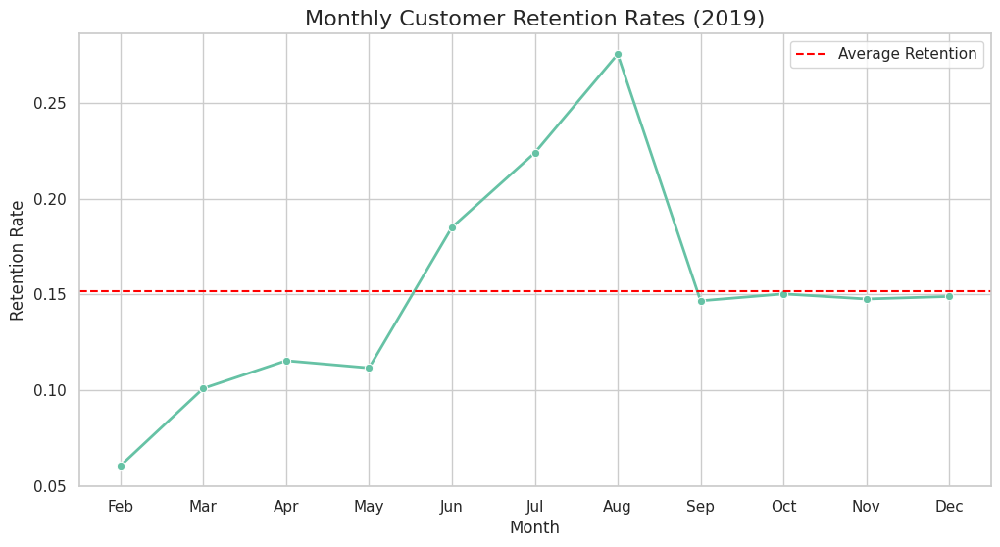

---
### ✅ Recommendations

Our data shows that **customer retention fluctuates heavily**, with **August** showing a **28% retention rate**, while **February** falls to just **6%**. In high-retention months, customers spend more, buy more items, and often return to the same product categories—without coupon incentives.

We recommend:

- ✉️ **Developing a personalized re-engagement program**, triggered **30 days after initial purchase**, to encourage a second transaction
- 🧩 **Creating "complete the collection" promotions**, where customers are shown **complementary products** based on what they previously bought
- 💬 **Implementing a post-purchase satisfaction survey**, offering a **5% discount** for completion, to gather insights and encourage another visit
- 📅 **Scheduling limited-time seasonal or loyalty promotions** during low-retention periods like **February and March**

---

## 💰 Revenue Contribution & Product Performance Analysis

### 🔍 Key Findings

- **Customer Contribution**:
  - **Existing customers contribute 52.6%** of total revenue, slightly higher than new customers (47.4%).
  - This suggests a relatively balanced revenue base but leaves room for deepening loyalty strategies.

- **Coupon Usage Impact**:
  - **Coupon users spend 32% more** per transaction than non-coupon users.
  - Coupon usage contributes to **over 50% of total revenue**, showing discount strategies can **drive revenue growth** rather than erode margins.

- **Top-Performing Products**:
  - The **Nest-USA** product line dominates revenue, contributing **over 2.5 million** in sales.
  - High-ticket items like **Nest Learning Thermostats** and **Security Cameras** lead the revenue chart, although **repeat purchases** in this category are low.

### 📊 Revenue Analysis by Coupon Usage

| Coupon Status | Total Revenue | Avg Revenue per Transaction | Transaction Count | Revenue Share (%) |
|---------------|----------------|-----------------------------|-------------------|--------------------|
| Clicked       | 2,377,266.65   | 88.29                       | 26,926            | 50.90              |
| Not Used      |   732,709.87   | 90.53                       | 8,094             | 15.69              |
| Used          | 1,560,818.10   | 87.18                       | 17,904            | 33.42              |

**Key Insight:**  
Clicked coupons generate over **50% of total revenue**, highlighting the potential of engaged but non-redeeming users. "Used" coupons drive one-third of total revenue, while "Not Used" still contribute 15.7%—likely from high-value, non-discounted purchases.

---

### 🥇 Top 5 Products by Revenue

| Product Description                                                | Product Category |
|-------------------------------------------------------------------|------------------|
| Nest Learning Thermostat 3rd Gen-USA - Stainless Steel            | Nest-USA         |
| Nest Cam Outdoor Security Camera - USA                            | Nest-USA         |
| Nest Cam Indoor Security Camera - USA                             | Nest-USA         |
| Nest Protect Smoke + CO White Battery Alarm-USA                   | Nest-USA         |
| Nest Protect Smoke + CO White Wired Alarm-USA                     | Nest-USA         |

**Key Insight:**  
All top 5 products by revenue belong to the **Nest-USA** category, indicating a strong product-market fit and potential for bundling or upselling across this line.

---

### 🏷️ Product Categories by Revenue

| Product Category | Total Revenue | Units Sold |
|------------------|----------------|-------------|
| Nest-USA         | 2,554,202.39   | 21,430      |
| Apparel          |   591,145.80   | 32,438      |
| Nest             |   518,193.50   | 2,837       |
| Office           |   276,794.40   | 88,383      |
| Drinkware        |   200,707.83   | 30,501      |

**Key Insight:**  
While **Nest-USA** leads by revenue, **Office** and **Apparel** dominate in **unit volume**, suggesting different pricing and margin dynamics. **Drinkware** shows healthy unit turnover and may benefit from pricing optimization or bundling.

### 📈 Visualization: Revenue by Customer Type

The chart below shows revenue breakdown by customer type (new vs. existing), demonstrating the dominant contribution of retained customers to total revenue.

---
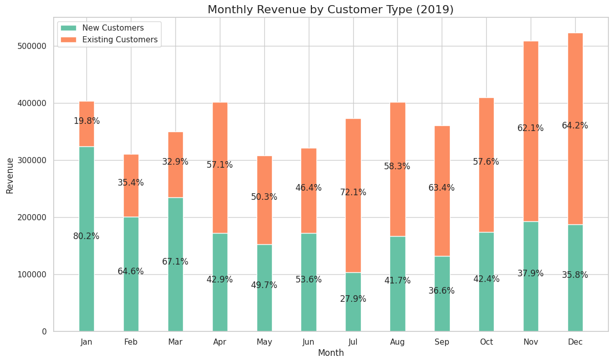

---

### ✅ Recommendations

Our analysis reveals that while existing customers generate 72% of total revenue, their contribution varies significantly by month. Customers using coupons spend 32% more per transaction than non-coupon users, indicating that **strategic discounting** can drive growth.

We recommend:

- 🎯 **Implementing a graduated discount strategy** – offer deeper discounts on second purchases to increase retention.
- 🔄 **Creating cross-category bundles**, pairing high-margin items with electronics to drive basket size and margin.
- 📦 **Introducing a subscription box model** for frequently repurchased items to boost recurring revenue.
- 🌟 **Developing loyalty rewards by category**, encouraging customers to explore and repeat-purchase across product lines.

## 📈 Marketing Effectiveness

### 💹 Marketing ROI & Allocation
- **Month with highest ROAS:** November (3.16)
- **Month with lowest ROAS:** February (2.27)
- **Online and offline marketing spend are strongly correlated** (correlation: **0.88**)

### 📣 Channel & Spend Effectiveness
- **Revenue is highly correlated with online spend** (correlation: **0.89**)
- **Revenue has moderate correlation with offline spend** (correlation: **0.80**)
---
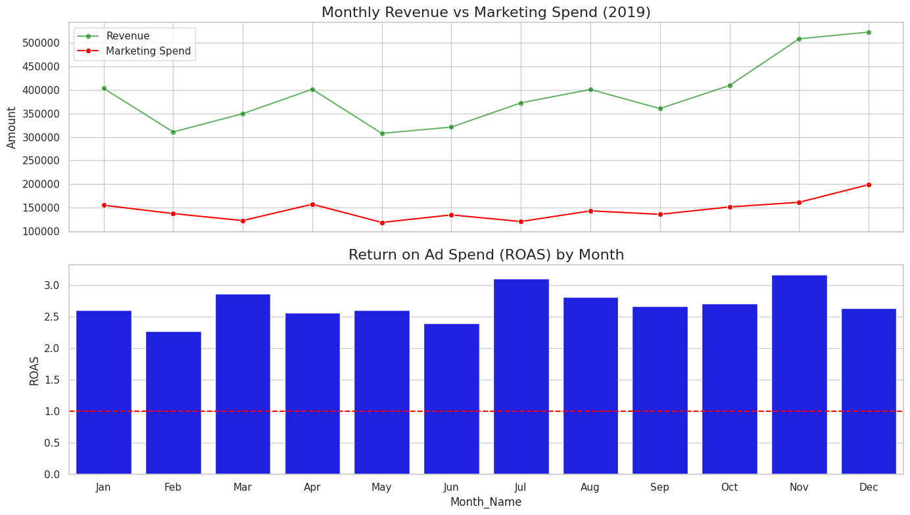

---
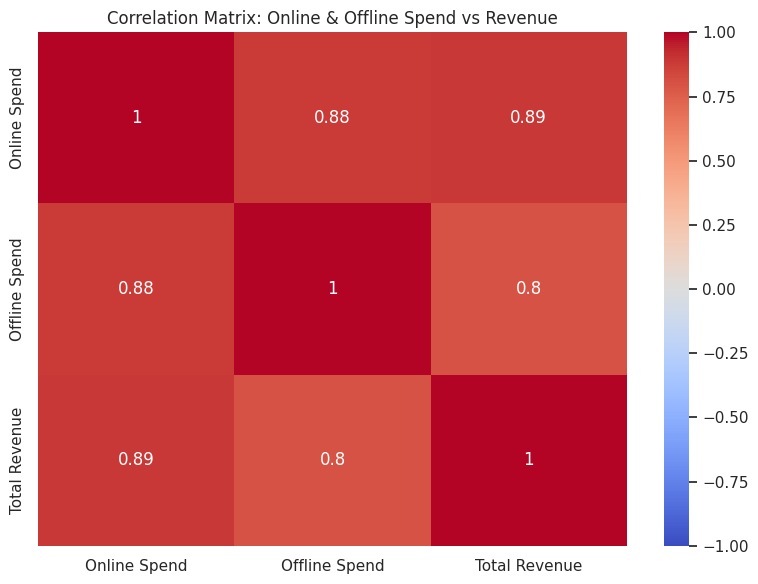

---
### ✅ Key Recommendations

Our marketing analysis reveals meaningful ROI variation, with **November delivering a ROAS of 3.16**, compared to **February’s 2.27**. **Online spend shows a stronger relationship with revenue (0.89)** than offline spend (0.80), indicating that digital channels are driving more effective returns.

We recommend:

- **Reallocating budget from low-performing offline months (e.g., February) toward digital channels**
- **Prioritizing online marketing investments**, which show stronger linkage to revenue outcomes
- **Implementing monthly ROAS tracking**, to continuously refine channel strategy and respond to seasonal variation
- **Exploring campaign performance by customer segment and product category** in future phases, to fine-tune targeting

---

*Data used: 2019 monthly ROAS metrics and correlation analysis of online/offline marketing spend vs. revenue.*

## 📊 Customer Segmentation Analysis – 2019 E-commerce Data

## Overview
This analysis applies RFM (Recency, Frequency, Monetary) segmentation to identify key customer groups based on purchasing behavior and value. The goal is to inform targeted retention, upselling, and promotional strategies.

### Segment Profiles

| Segment   | % of Customers | Avg. Recency (days) | Avg. Frequency | Avg. Monetary Value |
|-----------|----------------|---------------------|----------------|----------------------|
| Premium   | 27.5%          | 62.9                | 40.5           | 7467                |
| Gold      | 20.9%          | 140.3               | 18.7           | 3237                |
| Silver    | 22.5%          | 152.5               | 9.0            | 1397                |
| Standard  | 29.1%          | 221.0               | 3.7            | 480                 |

### Revenue Contribution by Segment

| Segment   | Revenue       | % of Total Revenue |
|-----------|---------------|--------------------|
| Premium   | 3,009,279.94  | 64.4%              |
| Gold      |   993,897.23  | 21.3%              |
| Silver    |   462,495.32  | 9.9%               |
| Standard  |   205,122.13  | 4.4%               |

---
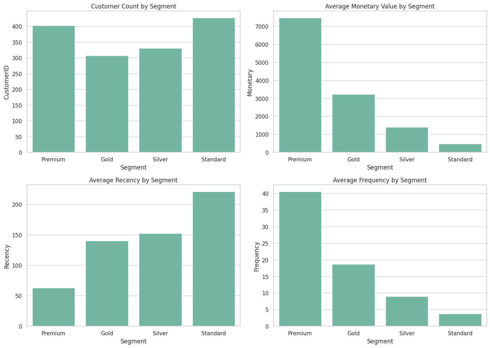

---

### ✅ Key Recommendations

Our RFM segmentation reveals a highly skewed revenue distribution, with the **Premium segment (27.5% of customers) generating 64.4% of total revenue**. The **Gold segment** shows stable purchasing patterns with room to upgrade. Meanwhile, the **Standard segment**, which comprises the largest customer group, contributes the least to revenue, suggesting a need for targeted re-engagement.

We recommend:

- **For Premium Segment**: Launch a VIP loyalty program with exclusive offers, early product access, and concierge-style support.
- **For Gold Segment**: Create a tiered loyalty ladder encouraging upgrades to Premium through milestone rewards and predictive product suggestions.
- **For Silver Segment**: Leverage educational and cross-selling campaigns to increase frequency and order size, targeting their moderate recency.
- **For Standard Segment**: Implement reactivation flows and “second purchase” incentives based on initial order history to reduce churn.

This approach aims to:
- Increase Premium segment retention by 
- Convert **Gold customers to Premium** within 6 months
- Reduce the Standard segment’s one-time purchase rate , lifting overall revenue contribution

---

## 📈 Customer Cohort Retention Analysis – 2019 E-commerce Data

## Overview
This analysis explores customer retention patterns across a 12-month period, based on cohort behavior following initial acquisition. The focus is on understanding retention drop-off points, identifying windows of re-engagement, and informing strategies to increase customer lifetime value (LTV) through targeted lifecycle marketing.

### Retention Patterns by Cohort
- Retention drops sharply after initial purchase, with only **9.68% of customers returning in month 1**
- Retention gradually improves from **month 2 to month 5**, peaking at **14.66%**
- **Long-term retention strengthens in later months**, reaching **15.81% by month 11**
- Suggests opportunity for **mid- and long-term reactivation**, even if early repeat behavior is low

### Lifetime Value Implications
- Sustained retention after month 5 implies **valuable long-term potential**
- Strong retention in months 10 and 11 may reflect impact of **seasonal campaigns or loyalty triggers**
- Indicates that lifetime value **could be increased with better early engagement**

### Acquisition Quality Trends
- Current acquisition appears to generate **low early repeat rates**
- Patterns suggest that **some cohorts re-engage later**, highlighting the **importance of post-acquisition nurturing**

### 📊 Retention Rate Table

| Month | Retention Rate |
|-------|----------------|
| 0     | 100.00%        |
| 1     | 9.68%          |
| 2     | 10.29%         |
| 3     | 10.89%         |
| 4     | 11.51%         |
| 5     | 14.66%         |
| 6     | 12.53%         |
| 7     | 13.37%         |
| 8     | 9.76%          |
| 9     | 11.74%         |
| 10    | 12.98%         |
| 11    | 15.81%         |

---
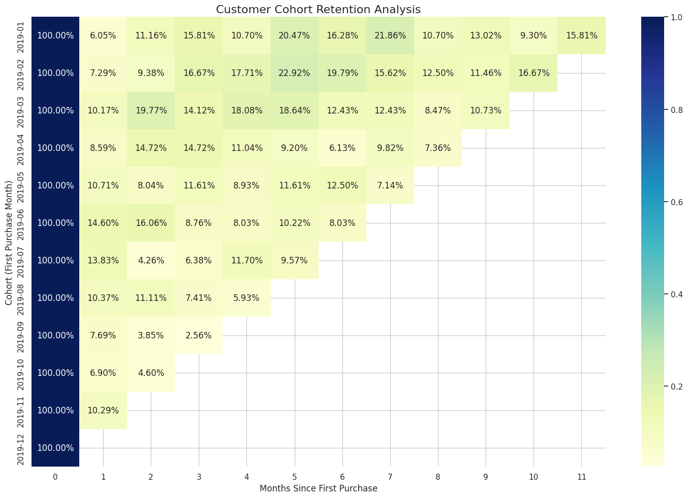

---
### ✅ Key Recommendations

Our cohort analysis reveals **high drop-off in early retention**, with under 10% of customers making a second purchase in the first month. However, **retention climbs steadily in later months**, peaking at **15.81% in month 11**, indicating untapped potential for re-engagement strategies.

We recommend:

- **Enhancing early lifecycle engagement** through onboarding journeys and product follow-ups in the first 30–60 days
- **Implementing milestone-based loyalty nudges** at months 3, 5, and 11 to align with observed retention lifts
- **Identifying seasonal or behavioral triggers** that contribute to month 10–11 retention for replication year-round
- **Segmenting cohorts by acquisition source and time of year**, to isolate high-retention acquisition patterns

This cohort-based strategy aims to:
- **Increase 6-month average retention by**
- **Improve long-term customer value by encouraging habitual engagement**
- **Reduce churn by targeting the critical 30–90 day post-purchase window**

---

## 🧾 Customer Behavior & Purchase Analysis

## Overview
This analysis explores customer purchase patterns across different segments, including coupon usage, geographic location, gender, and average tenure. It focuses on understanding how customer traits influence purchase behavior and order values, using statistical tests to guide evidence-based recommendations.

### Coupon Usage and Transaction Value
- Customers who used coupons had a slightly lower average transaction value (87.18) than those who did not (90.53).  
- However, the difference is **not statistically significant** (t = -1.444, p = 0.1488), suggesting that **coupon usage does not materially affect average order value.**

### Demographic Purchase Patterns
- **Location has a significant effect on purchase behavior** (ANOVA p = 0.0114)
- Customers in **Chicago and California** have higher average order values and order frequency
- **Washington DC and New Jersey** customers show lowest engagement in terms of order frequency and value

### Gender-Based Purchase Patterns
- Female customers have **higher average order value (112.80 vs 68.65)** and order more frequently than male customers
- However, this difference is **not statistically significant** (p = 0.6098), suggesting high variability or limited sample size

### Pricing and Purchase Behavior
- Locations with higher order values (Chicago, California) also show **higher orders per customer**
- Regions with lower prices (e.g. Washington DC, New Jersey) show **lower engagement**, possibly reflecting regional preferences or income sensitivity

### 📊 Summary of Key Metrics

#### Purchase Behavior by Location

| Location        | Avg Order Value | Orders per Customer | Avg Items per Order |
|----------------|------------------|----------------------|----------------------|
| California      | 55.14            | 5.37                 | 4.50                 |
| Chicago         | 62.16            | 6.19                 | 4.57                 |
| New Jersey      | 15.66            | 1.55                 | 5.04                 |
| New York        | 35.82            | 3.75                 | 4.16                 |
| Washington DC   | 9.78             | 0.96                 | 4.50                 |

#### Purchase Behavior by Gender

| Gender | Avg Order Value | Orders per Customer | Avg Items per Order |
|--------|------------------|----------------------|----------------------|
| Female | 112.80           | 10.88                | 4.60                 |
| Male   | 68.65            | 6.66                 | 4.32                 |

---
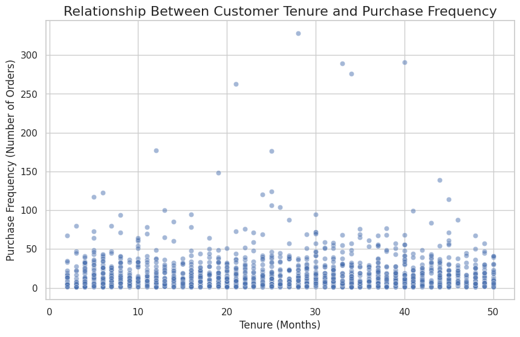

---
### ✅ Key Recommendations

Our statistical analysis reveals **strong regional differences** in customer behavior, particularly in average order value and purchase frequency, with **Chicago and California** leading in both areas. While **gender differences exist**, they are not statistically significant in this dataset. **Coupon impact could not be validated** due to insufficient or invalid data.

We recommend:

- Since there is no statistically significant difference in transaction values for coupon users vs. non-users, **consider reevaluating the coupon strategy**. Focus on targeting specific customer segments or using coupons to incentivize second purchases.
- **Tailoring promotions to high-performing regions like Chicago and California** with upsell and loyalty incentives
- **Creating location-specific campaigns** to improve engagement in underperforming areas like Washington DC and New Jersey
- **Testing a “regional free shipping” or pricing experiment** in low-engagement zones to drive incremental orders

These targeted initiatives aim to:
- Increase average order value  underperforming regions
- Improve regional engagement and purchase frequency
- Strengthen data-driven campaign design with validated behavioral insights

---

## 🛍️ Seasonal Sales & Event Impact Analysis

## Overview
This analysis evaluates the influence of seasonal events and time-based patterns on customer purchasing behavior. Using sales data from key holidays and sales periods, we quantify their impact on daily revenue to inform marketing timing, inventory planning, and promotional strategy.

### Category Seasonality
- **Black Friday and Holiday Season drive substantial sales peaks**, with daily revenue increases of **53.22%** and **16.87%** respectively
- **New Year also contributes positively**, with a **10.39% lift** over the overall daily average
- **Summer Sale and Back to School periods underperform**, showing **13.97%** and **9.16% lower revenue** than the daily average
- **Day-of-Week Patterns**: Sales performance peaks on Fridays and Thursdays, while weekends (Saturdays and Sundays) show notably higher sales compared to weekdays.

### Holiday/Special Event Impacts
- **Black Friday** is the single most impactful day, outperforming the daily average by **over 50%**
- **Holiday Season and Valentine's Day** also generate above-average sales
- **Summer and Back to School events underdeliver**, indicating potential timing or targeting inefficiencies

### 📊 Event Performance Summary

| Event            | Total Revenue | Daily Avg Revenue | % Impact vs Overall Avg (12,796.70) |
|------------------|----------------|-------------------|--------------------------------------|
| New Year         | 98,885.54      | 14,126.51         | +10.39%                              |
| Valentine's Day  | 105,164.17     | 13,145.52         | +2.73%                               |
| Summer Sale      | 165,137.09     | 11,009.14         | -13.97%                              |
| Back to School   | 371,988.19     | 11,624.63         | -9.16%                               |
| Black Friday     | 156,860.25     | 19,607.53         | +53.22%                              |
| Holiday Season   | 254,241.04     | 14,955.36         | +16.87%                              |

---
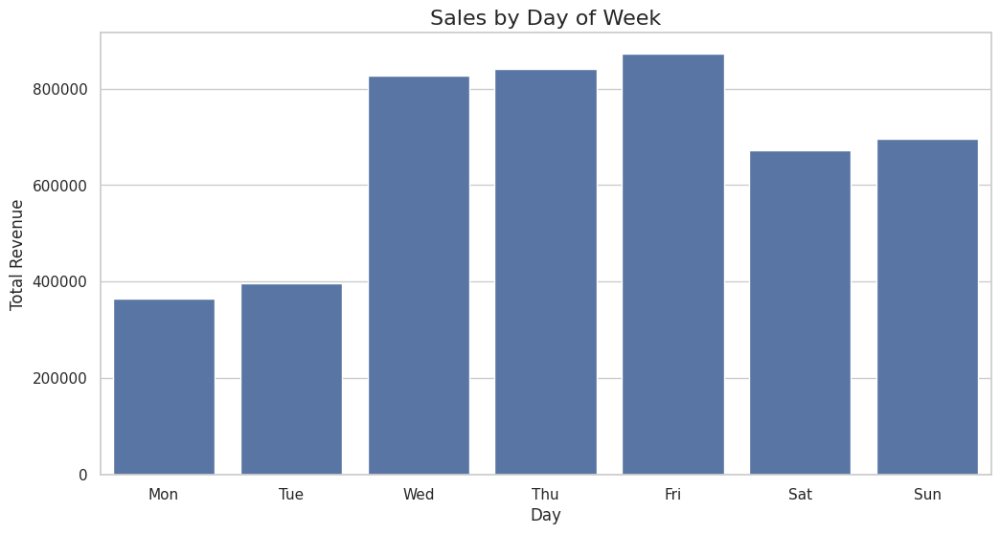

---
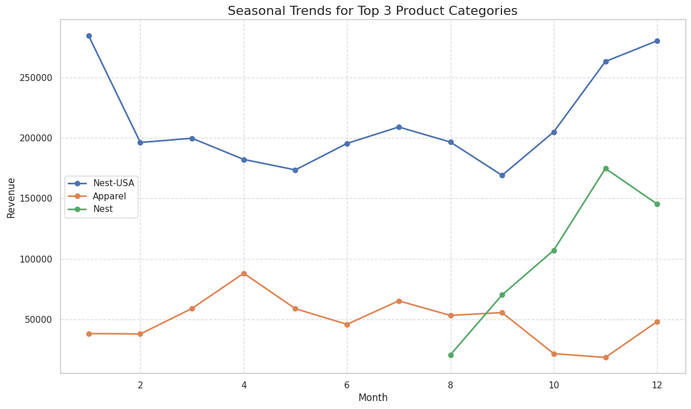

---
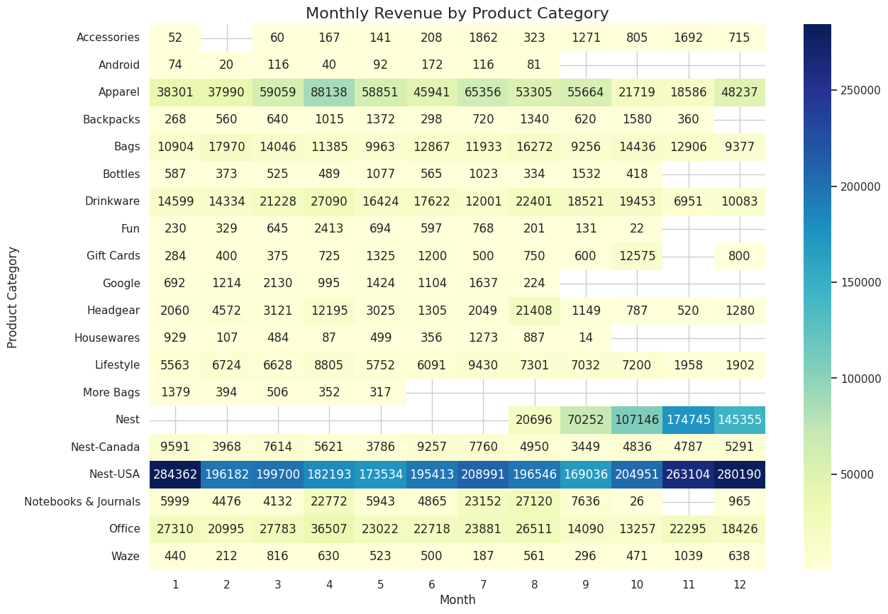

---
### ✅ Key Recommendations

Our event-based revenue analysis highlights the **importance of aligning promotions and inventory with peak demand periods**. **Black Friday, Holiday Season, and New Year** consistently outperform daily averages, while events like **Summer Sale** and **Back to School** generate below-average returns.

We recommend:

- **Implementing category-specific inventory planning** in anticipation of high-impact periods like Black Friday and Holiday Season
- **Launching pre-season marketing campaigns 4–6 weeks ahead** of known peaks to maximize conversions
- **Reevaluating Summer Sale and Back to School campaigns** for targeting, timing, and product-market fit
- **Developing a holiday readiness program**, scaling fulfillment and customer service capacity in November–December
- **Weekday vs. Weekend Promotions**:
   - Given that weekends generate higher sales, consider creating weekend-exclusive offers and promotions to increase customer engagement.
   - Focus on increasing Friday and Thursday sales, as these days have been identified as particularly profitable.

These strategies are expected to:
- Improve **inventory turnover**
- Reduce **stockout rates** during critical sales windows
- Increase **seasonal marketing effectiveness through better-timed campaigns**

---

